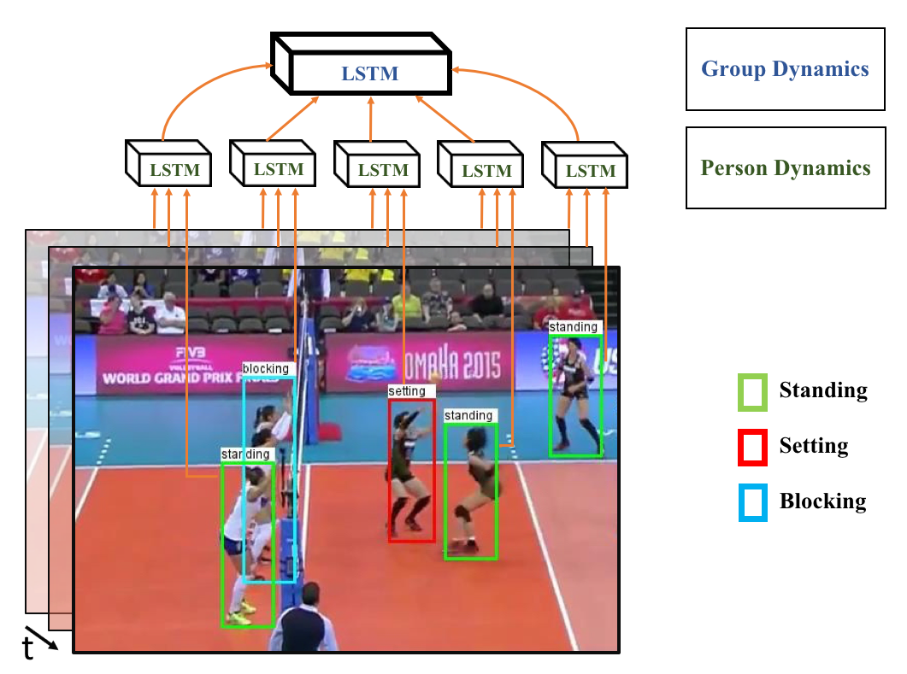
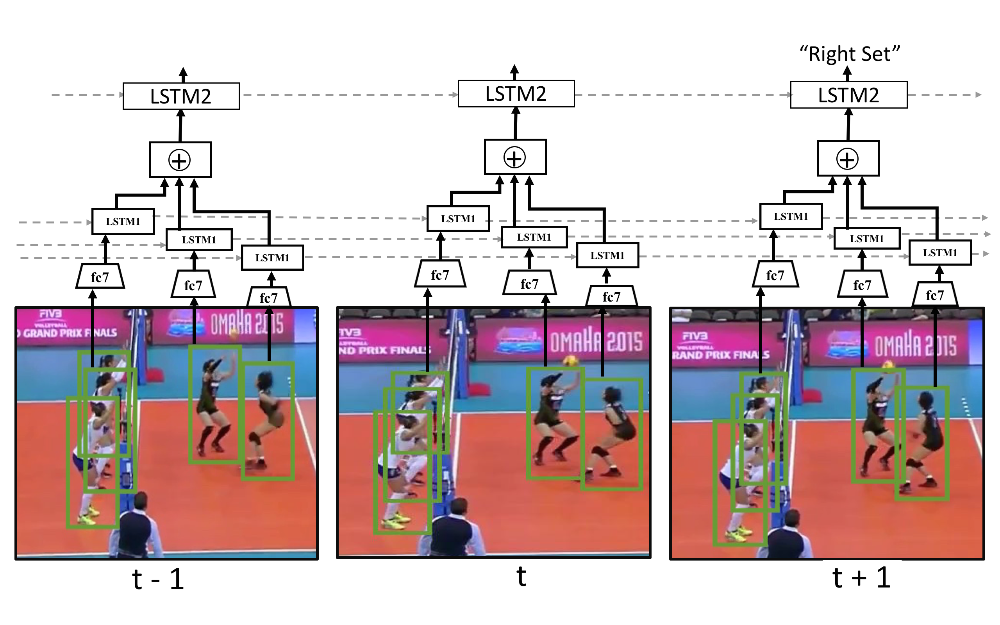
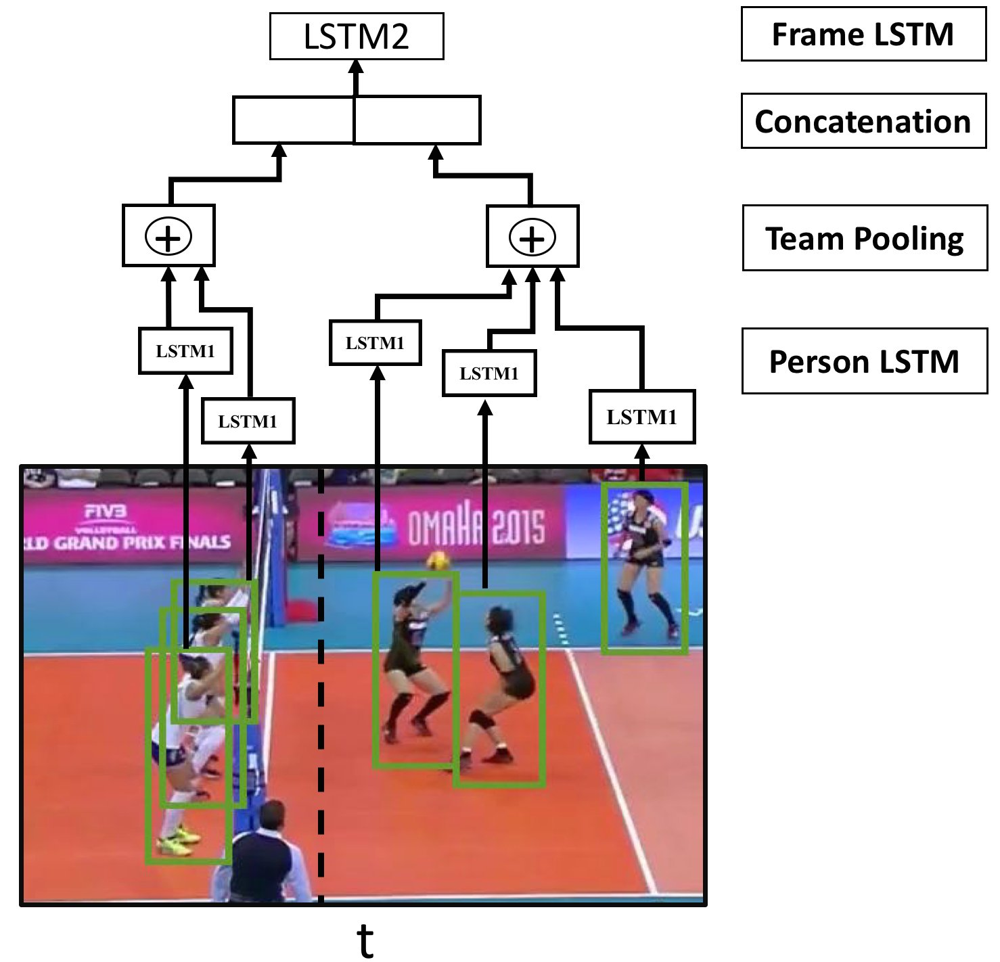

# 🚀 A Hierarchical Deep Temporal Model for Group Activity Recognition

This repository implements a **Hierarchical Deep Temporal Framework** for Group Activity Recognition (GAR) in volleyball videos, inspired by:

📄 https://www.cs.sfu.ca/~mori/research/papers/ibrahim-cvpr16.pdf  
**A Hierarchical Deep Temporal Model for Group Activity Recognition**  
Mostafa S. Ibrahim, Srikanth Muralidharan, Zhiwei Deng, Arash Vahdat, Greg Mori — CVPR 2016

---

## 🧠 Overview

This project models group interactions in sports videos through a hierarchical understanding of motion and context.

The system learns representations across three levels:

- 🧍 Player-level: Individual action representation using CNN features
- 🎞 Frame-level: Spatial aggregation of multiple players 
- ⏱ Temporal-level: Sequence modeling across frames
- 🏐 Group-level: Final activity classification

Each video clip is transformed from raw frames into structured spatio-temporal representations for group activity reasoning.

---

## Model



- Figure 1: High level figure for group activity recognition via a hierarchical model. Each person in a scene is modeled using a temporal model that captures his/her dynamics, these models are integrated into a higher-level model that captures scene-level activity.



- Figure 2: Detailed figure for the model. Given tracklets of K-players, we feed each tracklet in a CNN, followed by a person LSTM layer to represent each player's action. We then pool over all people's temporal features in the scene. The output of the pooling layer is feed to the second LSTM network to identify the whole teams activity.



- Figure 3: Previous basic mode drops spatial information. In updated model, 2-group pooling to capture spatial arrangements of players.


## 📊 Dataset

### 🧍 Individual Actions (9 classes)
waiting, setting, digging, falling, spiking, blocking, jumping, moving, standing  

### 🏐 Group Activities (8 classes)
r_set, r_spike, r_pass, r_winpoint, l_set, l_spike, l_pass, l_winpoint  

### 📦 Data Description
- Player bounding boxes per frame  
- Temporal tracking across video clips  
- Clip-level group activity labels  

---

## 🚧 Challenges

- Ambiguity between individual and group signals  
- Multi-player interactions in dynamic scenes  
- Temporal dependencies across frames  
- Spatial reasoning between teammates  

---
## 🧠 Model Architecture

| Model       | Description              | Architecture                         | Test Accuracy |
|------------|--------------------------|--------------------------------------|--------------|
| Baseline 1  | Simple CNN               | ResNet-50 frame classification       | 71.09%       |
| Baseline 3A | Feature extractor        | ResNet embeddings                    | 79.78%       |
| Baseline 3B | Enhanced features        | Improved representation learning     | 78.43%       |
| Baseline 4  | Temporal modeling        | LSTM sequence modeling              | 81.08%       |
| Baseline 5  | Multi-stream model       | Feature fusion architecture         | 83.32%       |
| Baseline 6  | Attention-based model    | Temporal attention mechanism        | 81.00%       |
| Baseline 7  | Hierarchical model       | Spatio-temporal hierarchy          | 84.82%       |
| Baseline 8  | Advanced LSTM (Best)    | Dual LSTM + team aggregation        | **87.96%**   |

## 🧩 Key Components

- 🔹 Feature Extraction: 2048-D ResNet embeddings from player crops  
- 🔹 Temporal Modeling: LSTM sequence learning  
- 🔹 Spatial Aggregation: Team-aware interaction modeling  
- 🔹 Hierarchical Classification: Individual → Group prediction  

---

## 📈 Key Insights

- Temporal modeling significantly improves performance  
- Team-based aggregation enhances group understanding  
- Hierarchical architectures outperform flat CNN models  
- Best performance achieved by dual-LSTM (Baseline 8)  

---

## 🏁 Best Model

🏆 **Baseline 8 (Advanced LSTM)**  
- Accuracy: **87.96%**  
- Captures team-level interaction dynamics 
- Strongest spatio-temporal representation
- Best generalization across group activities
---

## 🚀 Getting Started

```text
volleyball/
├── models/                 # Deep learning model architectures
├── Data/                  # Dataset loaders, annotations, and preprocessing
├── script/                # Training scripts for different baselines
├── engine/                # Training and inference engine functions
├── utils/                 # Helper functions and utility modules
├── confusion_matrix/     # Confusion matrix visualizations
├── config/               # Configuration files and constants
└── logs/                 # Training and evaluation logs
```

---

## 🔧 Feature Extraction

Extract temporal player-level deep features from volleyball video clips:

```bash
python -m Data.extract_feature
```

### Pipeline Overview

- Load volleyball video clips and tracking annotations  
- Crop individual player regions using bounding boxes  
- Extract 2048-D features using pretrained Baseline 3A backbone  
- Maintain consistent player identity across temporal frames  
- Build clip tensor:

```python
(num_players, temporal_frames, feature_dim)
# Example:
(12, T, 2048)
```

- Save processed dataset in compressed HDF5 format for efficient training

---

## ⚙️ Requirements

- GPU: NVIDIA GeForce RTX 3050 (Laptop GPU)
- VRAM: 6GB
- CUDA Support: Yes (CUDA 13.0)
- Python 3.10+

---

## 📦 Installation

```bash
git clone https://github.com/mohamedawzy22/A-Hierarchical-Deep-Temporal-Model-for-Group-Activity-Recognition.git
cd A-Hierarchical-Deep-Temporal-Model-for-Group-Activity-Recognition
pip install -r requirements.txt
```

---

## 🚀 Run

Run any baseline using:

```bash
python -m script.<MODEL_FILE>
```